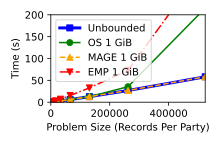

Benchmarking Scripts for MAGE
=============================
This repository contains a tool for benchmarking the MAGE system. The benchmarks are run primarily on Microsoft Azure (with some wide-area network experiments also using Google Cloud). The `magebench.py` tool allows one to spawn a virtual machines in the cloud, run benchmarks for MAGE using those virtual machines, collect log files containing the results of the benchmarks, and then deallocate those virtual machines. An IPython notebook, `graphs.ipynb` allows one to produce graphs based on the results, similar to the ones in the OSDI paper. This document contains instructions for reproducing the graphs in the submitted paper only. We *might* add additional graphs to the paper based on feedback in the reviews, but we haven't made those graphs yet, so we don't have scripts to produce them.

**Note: In aggregate, the benchmarks below take about two full days (almost 48 hours) to run.**

Setting Up `magebench.py` (15 minutes working)
----------------------------------------------

### Instructions for OSDI 2021 Artifact Evaluation

Welcome OSDI 2021 artifact reviewers! We are providing cloud virtual machines with the prerequisites for `magebench.py` pre-installed. Instructions for accessing these virtual machines are available on the private README file included in our artifact submission. Pay particular attention to the instructions on "claiming" an instance so that each reviewer gets their own cloud instance to run `magebench.py`.

#### Using the Cloud Instances

The instances we provide for running `magebench.py` are relatively cheap, so we'll leave them running for the duration of the artifact evaluation process. In contrast, the instances that you'll spawn using `magebench.py` are quite expensive, so you **should** make sure to deallocate them once you're done using them (see below for instructions on how to do this). Credentials for `magebench.py` to use our provided funding to access Microsoft Azure and Google Cloud are provided in the cloud instances themselves. If you prefer to use a computer other than our provided cloud virtual machines to run `magebench.py`, then contact us and we'll provide you with the credentials separately.

Once you access one of our provided instance, you should run `cd mage-scripts`. Then, you can run `./magebench.py` from there. To make things as easy as possible, our provided instances do not use a virtual environment for Python, and the necessary credentials for Microsoft Azure and Google Cloud are loaded automatically into environment variables (see `~/.profile` if you're interested). So running `./magebench.py` from the `mage-scripts` directory should just work.

#### Using `tmux`

Some of the experiments take several hours to run, so we recommend running `./magebench.py` from within a `tmux` session. Then, you can detach from the `tmux` session and disconnect from the cloud instance, while allowing `magebench.py` to keep running. This will prevent you from losing partial progress if there is a disruption in your internet service that prevents you from remaining SSH'd into the instance continuously for several hours.

If you aren't familiar with `tmux`, you can experiment with it by running a long-running command like `sleep 100`. You can do so by running the following commands:
1. First, run `tmux` to create a new terminal session.
2. Second, run `sleep 100`.
3. While the command is running, type `Ctrl-B`, and then press the `D` key.
4. You should now be detached from the `tmux` session. You can do anything you want from the original session, including disconnect and reconnect to the machine.
5. Run `tmux attach -t 0` to reattach to the `tmux` session. Observe that `sleep 100` is still running.

### Instructions for Setting Up `magebench.py` On Your Own System

You will need a system that runs Python 3 to run this tool. This system serves as the "master" node that coordinates the benchmarks. It must remain connected to the Internet with a stable IP address for the duration of each experiment. Some of these experiments may take up to 24 hours to complete. If you can keep your laptop running with a stable Internet connection for that long (without going to standby sleep), then you can install and run this tool on your laptop. If not, you should use a server that has a stable Internet connection and run the tool on that machine.

Once you have chosen the machine, you must install the tool. It is recommended that you use a virtual environment, so that you can install the correct versions of the requisite Python libraries without affecting the system's Python configuration.

First, install the prerequisites for `magebench.py`. The following command works on an Ubuntu 20.04 machine:
```
$ sudo apt install python3-venv python3-pip pkg-config python3-gi python3-gi-cairo gir1.2-gtk-3.0 libcairo2-dev gcc python3-dev libgirepository1.0-dev
```

Second, install the prerequisites for generating graphs using our IPython notebook:
```
$ sudo apt install jupyter-core jupyter python3-matplotlib
```

Then, clone this repository and `cd` into it:
```
$ git clone https://github.com/ucbrise/mage-scripts
$ cd mage-scripts
```

Next, set up the virtual environment:
```
$ python3 -m venv ./magebench-venv
```

Then, activate the virtual environment:
```
$ source ./magebench-venv/bin/activate
```
You should now see `(magebench-venv)` at the start of each terminal prompt, indicating that the virtual environment is active in this terminal. If you run `python3` and import libraries, it will search for the libraries in the virtual environment. If you wish to stop using `magebench.py` (e.g., at the end of the day), you can run `deactivate`. Once you do this, `python3` will no longer use the virtual environment to search for libraries. If you deactivate the virtual environment or close this terminal, and wish to continue using `magebench.py`, then you should re-run the above command to re-activate the virtual environment before continuing to use `magebench.py`.

With the virtual environment active, install the requisite libraries in the virtual environment:
```
$ pip3 install -r requirements.txt
```
You only have to do this the _first_ time you use a virtual environment. If you close the terminal or run `deactivate` to stop using `magebench.py` temporarily, you do not have to re-run the above command when resuming experiments. You can just re-activate the virtual environment (`source ./magebench-venv/bin/activate`) and you'll be good to go.

The `magebench.py` program will attempt to allocate cloud resources using Microsoft Azure and Google Cloud. For this to work, you need to set the appropriate environment variables so that `magebench.py` can authenticate to Microsoft Azure and Google Cloud. You should set the environment variables `AZURE_TENANT_ID`, `AZURE_CLIENT_ID`, and `AZURE_CLIENT_SECRET` to interact with Microsoft Azure, and `GOOGLE_APPLICATION_CREDENTIALS` to interact with Google Cloud. If you are a reviewer for OSDI Artifact Evaluation, you can obtain suitable credentials by looking at `~/setup_credentials.sh` in the provided cloud VM for running `magebench.py`. Otherwise, you will need to set up users/apps linked to billing accounts for Microsoft Azure and Google Cloud to pay for the resources used.

Finally, you can run:
```
$ ./magebench.py -h
```
If all of the previous steps completed successfully, this should print usage information for the `magebench.py` command-line tool. There should be no Python error or traceback.

Cluster Management Tutorial (5 minutes working, 10 minutes waiting)
-------------------------------------------------------------------
We use the term _cluster_ to mean a group of (virtual) machines that are used together to perform a computation using MAGE. The machines need not be co-located. For the wide-area experiments, different machines in the same cluster may be hosted by different cloud providers in geographically-distinct regions. The cluster's _configuration_ refers to the number of machines hosted by each cloud provider in each region.

One can use `magebench.py` to spawn a cluster, with a particular configuration passed to the cluster on the command line. This exercise will help you get familiar with this arrangement.

Run the following command:
```
$ ./magebench.py spawn -a 1 -g oregon
```
This command will spawn one virtual machine instance on Microsoft Azure and one virtual machine instance on Google Cloud. Microsoft Azure instances are always in US West 2 (Oregon); the Google Cloud instance is in `us-west1` (as indicated by the `oregon` CLI argument). Then, it will wait for a few minutes for the virtual machines to boot. After that, it will run scripts (called _provisioning_) to establish shared CKKS secrets across the machines (so that they can work together to perform a computation using CKKS) and generate configuration files for experiments using the machines' IP addresses. There is also a `./magebench.py provision` command, but you do not normally need to run it because `magebench.py spawn` will provision the machines already.

Once you've spawned the cluster, you'll notice that a new file, `cluster.json` has been created. This file allows `magebench.py` to keep track of what resources it has allocated, including the IP addresses of the virtual machines so that it can interact with them. If you're curious, you can use Python to pretty-print `cluster.json`, which will produce output similar to this:
```
$ python3 -m json.tool cluster.json
{
    "name": "mage-cluster",
    "azure_rg_id": "/subscriptions/a8bdae60-f431-4620-bf0a-fad96eb36ca4/resourceGroups/mage-cluster-rg",
    "azure_vnet_id": "/subscriptions/a8bdae60-f431-4620-bf0a-fad96eb36ca4/resourceGroups/mage-cluster-rg/providers/Microsoft.Network/virtualNetworks/mage-cluster-vnet",
    "azure_nsg_id": "/subscriptions/a8bdae60-f431-4620-bf0a-fad96eb36ca4/resourceGroups/mage-cluster-rg/providers/Microsoft.Network/networkSecurityGroups/mage-cluster-nsg",
    "azure_subnet_id": "/subscriptions/a8bdae60-f431-4620-bf0a-fad96eb36ca4/resourceGroups/mage-cluster-rg/providers/Microsoft.Network/virtualNetworks/mage-cluster-vnet/subnets/mage-cluster-subnet",
    "machines": [
        {
            "public_ip_address": "40.91.121.173",
            "azure_public_ip_address_id": "/subscriptions/a8bdae60-f431-4620-bf0a-fad96eb36ca4/resourceGroups/mage-cluster-rg/providers/Microsoft.Network/publicIPAddresses/mage-cluster-0-ip",
            "azure_nic_id": "/subscriptions/a8bdae60-f431-4620-bf0a-fad96eb36ca4/resourceGroups/mage-cluster-rg/providers/Microsoft.Network/networkInterfaces/mage-cluster-0-nic",
            "azure_ip_configuration_id": "/subscriptions/a8bdae60-f431-4620-bf0a-fad96eb36ca4/resourceGroups/mage-cluster-rg/providers/Microsoft.Network/networkInterfaces/mage-cluster-0-nic/ipConfigurations/mage-cluster-ip",
            "private_ip_address": "10.0.0.4",
            "vm_id": "/subscriptions/a8bdae60-f431-4620-bf0a-fad96eb36ca4/resourceGroups/mage-cluster-rg/providers/Microsoft.Compute/virtualMachines/mage-cluster-0",
            "vm_name": "mage-cluster-0",
            "disk_name": "mage-cluster-0_disk1_ee75d89c3fa740a3a07cf2adfdd8ecf8",
            "gcp_zone": null,
            "provider": "azure"
        },
        {
            "public_ip_address": "35.233.188.71",
            "azure_public_ip_address_id": null,
            "azure_nic_id": null,
            "azure_ip_configuration_id": null,
            "private_ip_address": "10.138.0.50",
            "vm_id": "8649226936545191114",
            "vm_name": "mage-cluster-oregon",
            "disk_name": "mage-cluster-oregon",
            "gcp_zone": "us-west1-b",
            "provider": "gcloud"
        }
    ],
    "num_lan_machines": 1,
    "location_to_id": {
        "oregon": 1
    }
}
```
You can SSH manually into one of the instances by running `ssh -i mage mage@40.91.121.173` (where you would change the IP address according to your personal `cluster.json` file). You won't need to do that to use `magebench.py`, but you may find it useful to that if you want to do your own experimentation with MAGE using the Azure machines as a build environment (e.g., when following the tutorial in the [MAGE wiki](https://github.com/ucbrise/mage/wiki)).

If you want to take a break, or if you're done for the day, you should deallocate the cluster's resources by running:
```
$ ./magebench deallocate
```
This will free all of the resources associated with the cluster and delete the `cluster.json` file. _You should make sure not to move, rename, or delete the `cluster.json` file before running `./magebench.py deallocate`._ If you do, `magebench.py` won't know how to contact the machines in the cluster. A copy of `cluster.json` is placed in the home directory of the user `mage` of each machine in the cluster. If you accidentally lose the `cluster.json` file, but still know the IP address of one of the machines, you can recover `cluster.json` by using `scp`. Barring that, you can delete the cluster and start over by running `./magebench purge`, passing the same command line arguments that were passed to `./magebench spawn`. For example, if you accidentally lost the `cluster.json` file in the above example, you still could delete the cluster by running `./magebench purge -a 1 -g oregon`.

When you run benchmarks using the `magebench.py` tool, the log file containing the measurements are stored on the virtual machines themselves. **Thus, you should copy the log files to the machine where you are running `./magebench.py` before deallocating the cluster.** The following command will copy the logs from each node in the cluster to a directory called `logs` on the local machine:
```
$ ./magebench.py fetch-logs
```
Once you have the logs locally, you can use an IPython notebook to generate figures in the same form as the ones in the OSDI paper. Run `jupyter notebook` and open `graphs.ipynb` to do this.

A Simple, Guided Example (15 minutes working, 20 minutes waiting)
-----------------------------------------------------------------
Now that you're able to spawn and deallocate a cluster, let's walk through a simple example in which you run an experiment and generate a plot using the provided scripts.

First, start a cluster:
```
$ ./magebench.py spawn -a 2
```
The cluster consists of two virtual machines on Azure, in the same region (West US 2).

Next, we will run the `merge` problem using MAGE:
```
$ ./magebench.py run-lan -t 1 -s mage -p merge_sorted_1048576
```
This runs MAGE's planner on each machine on the `merge` program (problem size `1048576`), and then executes the resulting memory program on the two machines. It will take a few minutes to run.

The `magebench.py` script also allows you to run multiple experiments with a single. The above experiment used the "MAGE" scenario in the paper. To run the "OS" an "Unbounded" scenarios, run:
```
$ ./magebench.py run-lan -t 1 -s os unbounded -p merge_sorted_1048576
```
This will take significantly longer to run because (1) it is running 2 experiments, one after the other, and (2) the OS scenario takes much longer than the MAGE and Unbounded setups. Note that `magebench.py` allows running multiple scenarios in a single command.

Finally, run:
```
$ ./magebench.py fetch-logs logs-workloads-2
```
This copies the log files, which includes how long the total execution took, to the local machine. You can find the files locally, in `logs-workloads-2/00` (for the garbler) and `logs-workloads-2/01` (for the evaluator). The files that end in `.log` correspond to the actual execution, and the files that end in `.planning` correspond to MAGE's planning phase. The last line of each `.log` file says how long the experiment took. There are two `.log` files per experiment (one in `00` and another in `01`) because the garbler and evaluator independently measure how long the execution took.

Now that you have the log files locally, let's draw a graph representing our data. We have three data points (for each of the three scenarios), so we'll draw a bar graph showing all three data points.

Run `jupyter notebook` to start an IPython notebook. If you're running this locally (e.g., on your laptop), your web browser should open, displaying a web page (probably hosted on `localhost:8888`). If you are running this on a remote server, you'll need to configure Jupyter to serve globally. If you are an OSDI Artifact Evaluator using one of our provided cloud instances, then everything should be pre-configured; see the directions in the private README file.

Click on `graphs.ipynb` and run the first few cells. Eventually, you will reach a cell labeled, "Simple, Guided Example". Run the next four cells, ensuring that the variable `simple_directory` is correct (this is the directory where the code will look for the log files you downloaded above). The next cell will show a bar graph with the data from the experiment you just ran. It should look similar to this:


Note that the MAGE and Unbounded scenarios take about the same time to run, but the OS scenario takes significantly longer.

In a later section of this document, you will populate `logs-workloads-2` with the results of more experiments.

**Optional:** Most of the work in the guided example was in the commands of the form `$ ./magebench.py run-lan ...`. If you'd like to see how to use `mage` directly, then work through the tutorial on the [MAGE wiki](https://github.com/ucbrise/mage/wiki).

Running the Experiments
-----------------------
The following subsections discuss how to use the `./magebench.py` script to reproduce the experiments. Each subsection below discusses reproducing a single graph or group of graphs. Each one will involve a fair bit of waiting to wait for the benchmarks to run and the results to become available.

If you'd rather do all of the waiting up front, you can run `./run_all_experiments.sh`. It will run all of the benchmarks described below. It will take about two full days (almost 48 hours) to run, so you'll probably want to use `tmux` as described above. Once this completes, you can skip all of the commands in each of the subsections below (and all of the waiting for experiments to complete) and then just generate the graphs in the IPython notebook.

Baseline: Comparison to Existing Frameworks (5 minutes working, 4-5 hours waiting)
--------------------------------------------------------------------------------
Run the following commands:
```
$ ./magebench.py spawn -a 2
$ ./magebench.py run-halfgates-baseline -t 1 -s os unbounded mage emp -z 1024 2048 4096 8192 16384 32768 65536 131072 262144 524288 1048576
$ ./magebench.py run-ckks-baseline -t 1 -s os unbounded mage seal -z 64 128 256 512 1024 2048 4096 8192 16384
$ ./magebench.py fetch-logs logs-baseline
$ ./magebench.py deallocate
```
After running the `fetch-logs` command, you should see a local directory `logs-baseline` containing the log files for these experiments. In the `graphs.ipynb` IPython notebook, go to the **Baseline Experiments** section. Make sure that the first cell assigns `baseline_directory` correctly (this should be `logs-baseline`, where the above `fetch-logs` command placed the log files). Then, run the cells in this section. The resulting graphs should be similar to Figures 6 and 7 in the paper:




Ten Workloads: One Worker Per Party (5 minutes working, 10 hours waiting)
-------------------------------------------------------------------------
Run the following commands:
```
$ ./magebench.py spawn -a 2
$ ./magebench.py run-lan -p merge_sorted_1048576 full_sort_1048576 loop_join_2048 matrix_vector_multiply_8192 binary_fc_layer_16384 real_sum_65536 real_statistics_16384 real_matrix_vector_multiply_256 real_naive_matrix_multiply_128 real_tiled_16_matrix_multiply_128 -s unbounded mage os -t 1 -w 1
$ ./magebench.py fetch-logs logs-workloads-2
$ ./magebench.py deallocate
```
After running the `fetch-logs` command, you should see a local directory `logs-workloads-2` containing the log files for these experiments. In the `graphs.ipynb` IPython notebook, go to the **Single-Node Experiments** section. Make sure that the first cell assigns `single_node_directory` correctly (this should be `logs-workloads-2`, where the above `fetch-logs` command placed the log files). Then, run the cells in this section. The resulting graph should be similar to Figure 8 in the paper:


The graph given in the paper was produced form 8 trials for each experiment, on different instances. The graph in the IPython notebook is produced using only one trial, so no error bars are present, and some variation should be expected. In particular, the error bars in the paper depict the quartiles, so there is about a 50% chance that the results obtained by running the above command will be within the error bars. My qualitative observation is that the deviation from the median appears consistent for each machine. In other words, if one workload runs more slowly (respectively, quickly) than the median on one machine or pair of machines, the remaining workloads are also likely to run more slowly (respectively, quickly) on that machine or pair of machines.

The IPython notebook also prints out measurements corresponding to Tables 1 and 2 in the paper.

Ten Workloads: Four Workers Per Party (5 minutes working, 20 hours waiting)
---------------------------------------------------------------------------
Run the following commands:
```
$ ./magebench.py spawn -a 8
$ ./magebench.py run-lan -p merge_sorted_4194304 full_sort_4194304 loop_join_4096 matrix_vector_multiply_16384 binary_fc_layer_32768 real_sum_262144 real_statistics_65536 real_matrix_vector_multiply_512 real_naive_matrix_multiply_256 real_tiled_16_matrix_multiply_256 -s unbounded mage os -t 1 -w 4
$ ./magebench.py fetch-logs logs-workloads-8
$ ./magebench.py deallocate
```
After running the `fetch-logs` command, you should see a local directory `logs-workloads-8` containing the log files for these experiments. In the `graphs.ipynb` IPython notebook, go to the **p = 4 Parallelism Experiments** section. Make sure that the first cell assigns `multi_node_directory` correctly (this should be `logs-workloads-8`, where the above `fetch-logs` command placed the log files). Then, run the cells in this section. The resulting graph should be similar to Figure 9 in the paper:


No error bars are presented in the paper, so some variation should be expected. Just as in the previous figure, all of the workloads are likely to deviate from those in the paper in the same direction.


WAN Experiments: Parallel Connections (5 minutes working, 9 hours waiting)
--------------------------------------------------------------------------
```
$ ./magebench.py spawn -a 1 -g oregon iowa
$ ./magebench.py run-wan oregon -p merge_sorted_1048576 -s mage -t 10 -w 1 2 4 -o 128 -c 1
$ ./magebench.py run-wan iowa -p merge_sorted_1048576 -s mage -t 10 -w 1 2 4 -o 128 -c 1
$ ./magebench.py fetch-logs logs-wan-conn
$ ./magebench.py deallocate
```
After running the `fetch-logs` command, you should see a local directory `logs-wan-conn` containing the log files for these experiments. In the `graphs.ipynb` IPython notebook, go to the **WAN Experiments: Number of Connections** section. Make sure that the first cell assigns `wan_conn_directory` correctly (this should be `logs-wan-conn`, where the above `fetch-logs` command placed the log files). Then, run the cells in this section. The resulting graph should be similar to Figure 10 in the paper:


For this graph, you may see some variation compared to the ones in the OSDI paper because (1) it depends on wide-area network conditions, which fluctuate, and (2) we improved MAGE after the submission to allow multiple outstanding OTs over a single connection, allowing it rely on fewer threads. To give you an idea of the expected variation, here is an example of a graph based on a more recent run of this experiment:


WAN Experiments: Parallel OTs (5 minutes working, 2.5 hours waiting)
------------------------------------------------------------------
Run the following commands:
```
$ ./magebench.py spawn -a 1 -g oregon
$ ./magebench.py run-wan oregon -p merge_sorted_1048576 -s mage -t 1 -w 1 -o 2 4 8 16 32 64 128 256 -c 2
$ ./magebench.py fetch-logs logs-wan-ot
$ ./magebench.py deallocate
```
After running the `fetch-logs` command, you should see a local directory `logs-wan-ot` containing the log files for these experiments. In the `graphs.ipynb` IPython notebook, go to the **WAN Experiments: OT Parallelism** section. Make sure that the first cell assigns `wan_ot_directory` correctly (this should be `logs-wan-ot`, where the above `fetch-logs` command placed the log files). Then, run the cells in this section. The resulting graph should show the running time decrease as the number of concurrent OTs increases. Here is results from our run, including 10 trials and error bars depicting the quartiles:


**There is no analogue of this graph in the paper; it corresponds to the statement in Section 8.7 that we can overcome the WAN latency by performing more OTs concurrently. I *might* add a graph to this effect in the camera-ready version (with the shepherd's approval).**

To make this experiment fast, the command above runs only one trial for each point in the graph; in contrast, our sample graph above does 10 trials. As a result, the graph produced in the IPython notebook might appear less "smooth" than the sample graph above. If you have extra time, you can try increasing the number of trials (e.g., use `-t 3` or `-t 10` instead of `-t 1` when running the above command), but this will take significantly longer.
